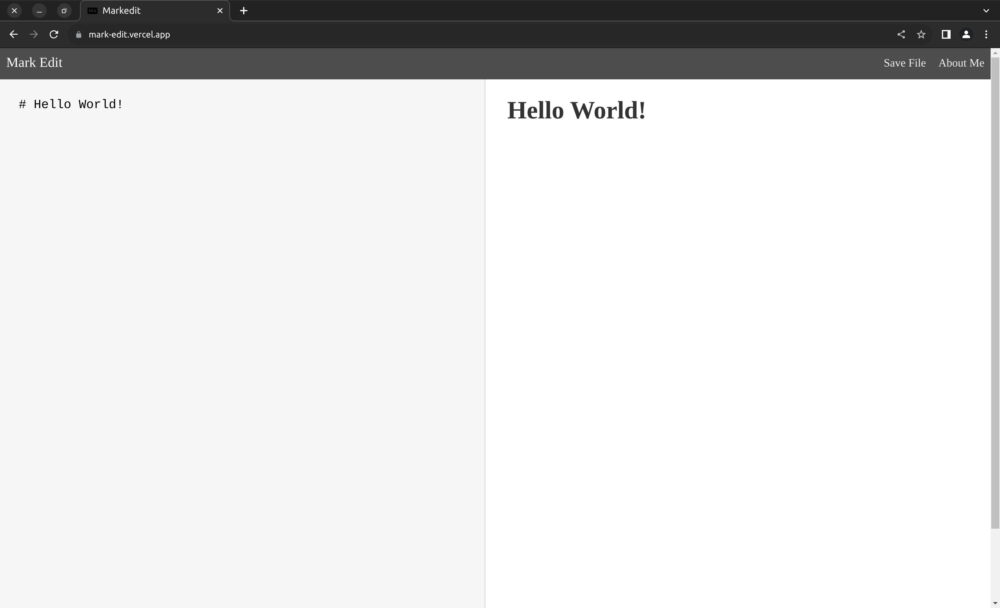

# markedit

Simple Mark Down Editor.

## 📦 Tech Stack:

- [Vite](https://vitejs.dev/)  - Next Generation Frontend Tooling.
- [Typescript](https://www.typescriptlang.org/)  - JavaScript with syntax for types.

## Demo:

<a href="https://mark-edit.vercel.app/">

</a>


## Getting Started: 

- Clone repository 

```bash
mkdir ~/Dev/markedit -p
cd ~/Dev/markedit
git clone https://github.com/Arvind-4/markedit.git .
```  

- Install Dependencies:

```bash
cd ~/Dev/markedit
npm i
```

- Run Server:

```bash
npm run dev
```

Open [localhost:5173](http://localhost:5173) in your favourite browser :)
